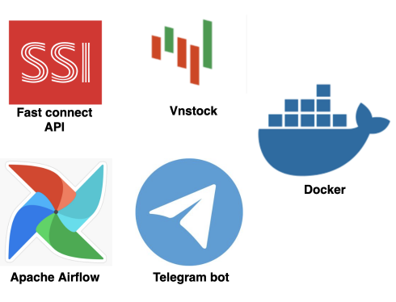
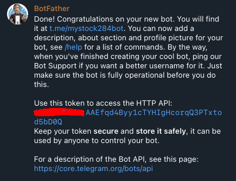
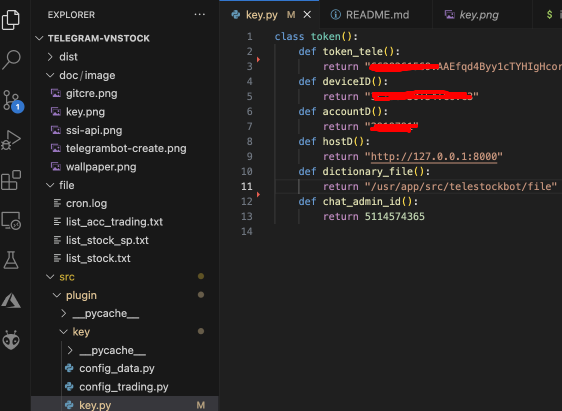
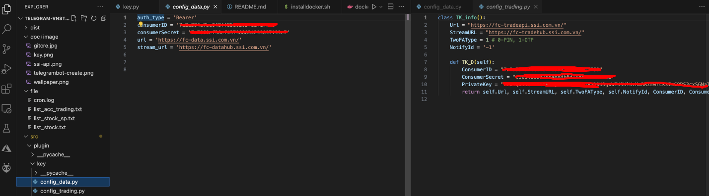
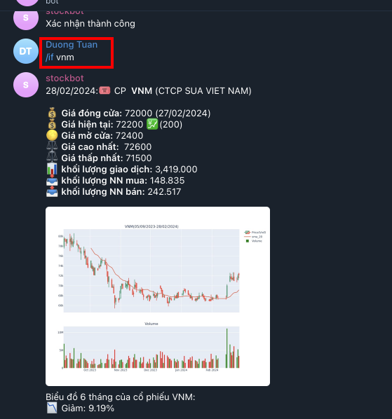

# Build a Real-time VN Stock Alert Messaging and Trading System
<p align="center">
  
</p>
Stay informed on-the-go with our Real-Time Stock Alert Messaging System, an solution designed to bring you instant market updates without depending on constant screen monitoring. Our sophisticated system not only leverages Python for immediate notifications but also integrates seamlessly with the Telegram bot app to offer a direct, interactive trading experience.

## Getting Started

<b>Prerequisites and Modules</b>

Before setup and running, please ensure you have the following prerequisites in place:

1. <b>Registration for SSI FastAPI Access:</b> This will grant you the necessary permissions to access batch and real-time stock data, as well as execute trades

2. <b>Setting up Telegram Bot:</b> This will receive instant stock alerts and interact with api to get data.
<p align="center">
  
</p>

3. <b>Docker(version 24.0.2) and Docker compose(version 2.19.1):</b> Make sure you have Docker and Docker compose correctly installed.

These prerequisites are essential for setting up and running the Real-time VN Stock Alert Messaging System and Trading.

## Setup:

- Clone the repository:
```
git clone https://github.com/ntd284/Telegram-Vnstock.git
```
- Add secret code into `key.py`, `config_data.py`, and `config_trading.py`:




- Install Docker, Docker compose:
```
sudo ./installdocker.sh
docker --version
docker compose version
```
- Build docker:
```
docker compose up
```

### Run Real-time VN Stock Alert Messaging and Trading System 

After setting up your environment with Docker and registering for necessary API access, you can start using the Real-time VN Stock Alert Messaging and Trading System. Here are the Telegram bot commands that will help you navigate the stock market:

-**/if [stock_symbol]:** Get detailed information on a specific stock by using this command followed by the stock's symbol (e.g., `/if VNM`). You'll receive the latest stock data directly in your Telegram chat.

<p align="center">
  
</p>


