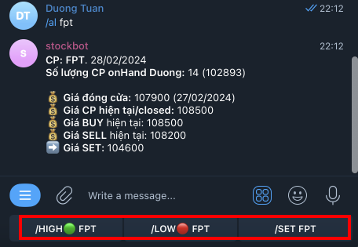
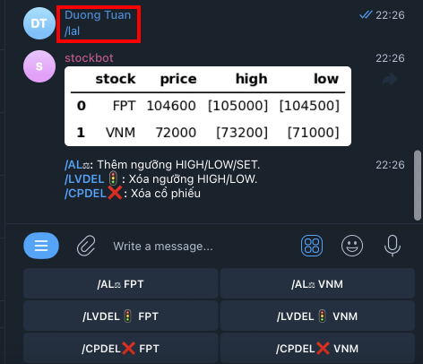
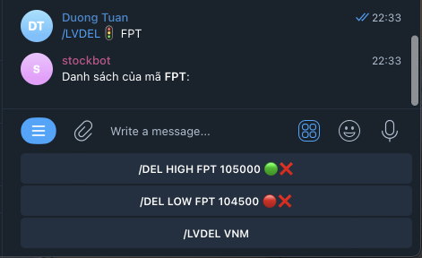
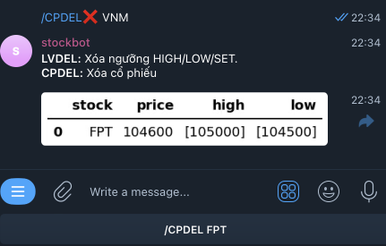
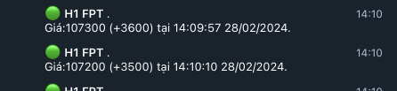
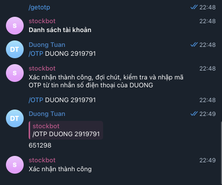
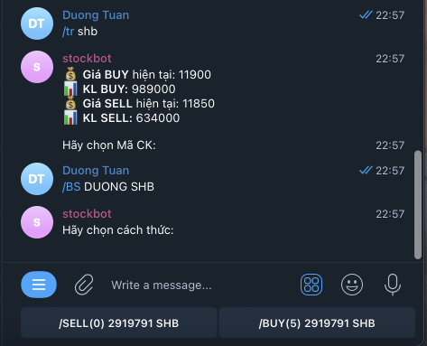
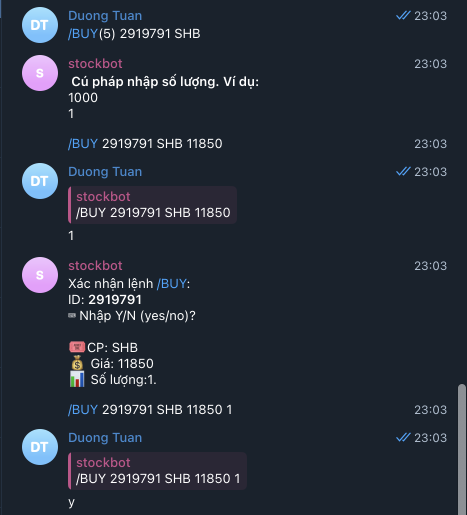

# Build a Real-time VN Stock Alert Messaging and Trading System

<p align="center">
  
</p>

Stay informed on-the-go with our Real-Time Stock Alert Messaging System, an solution designed to bring you instant market updates without depending on constant screen monitoring. Our sophisticated system not only leverages Python for immediate notifications but also integrates seamlessly with the Telegram bot app to offer a direct, interactive trading experience.

## Getting Started

<b>Prerequisites and Modules</b>

Before setup and running, please ensure you have the following prerequisites in place:

1. <b>Registration for SSI FastAPI Access:</b> This will grant you the necessary permissions to access batch and real-time stock data, as well as execute trades.


2. <b>Setting up Telegram Bot:</b> This will receive instant stock alerts and interact with api to get data.

<p align="center">
  
</p>

3. <b>Docker(version 24.0.2) and Docker compose(version 2.19.1):</b> Make sure you have Docker and Docker compose correctly installed.

These prerequisites are essential for setting up and running the Real-time VN Stock Alert Messaging System and Trading.

## Setup:

- Clone the repository:
```
git clone https://github.com/ntd284/Telegram-Vnstock.git
```
- Add secret code into `key.py`, `config_data.py`, and `config_trading.py`:


- Install Docker, Docker compose:
```
sudo ./installdocker.sh
docker --version
docker compose version
```
- Build docker:
```
docker compose up
```

## Run Real-time VN Stock Alert Messaging and Trading System 

After setting up your environment with Docker and registering for necessary API access, you can start using the Real-time VN Stock Alert Messaging and Trading System. Here are the Telegram bot commands that will help you navigate the stock market:

### Monitoring Data Mode Commands

1. `/if [stock_symbol]:` [main.py](src/main.py) and [ssi_data.py](src/plugin/ssi_data.py)

Get detailed information on a specific stock by using this command followed by the stock's symbol (e.g., `/if VNM`). You'll receive the latest stock data directly in your Telegram chat.

<p align="center">
  
</p>

2. `/al [stock_symbol]:` [main.py](src/data.py) and [ssi_data.py](src/plugin/ssi_data.py)

Set a price alert for a chosen stock by following this command with the stock's symbol (e.g., `/al VNM`). Information also shows my the number of on-hand stock (14 stocks FPT).

<p align="center">
  
</p>

 - We can set `High`, `Low` and `standard` level.

<p align="center">
  
</p>

3. `/lal [stock_symbol]:` [main.py](src/data.py) and [ssi_data.py](src/plugin/ssi_data.py)

View the list of stocks you're monitoring by sending this command. It shows all the stocks with active alerts, helping you keep track of your investments.

<p align="center">
  
</p>

In this image, we can see two other commands:
- `/LVDEL:` Remove sets of price level (HIGH/LOW).

<p align="center">
  
</p>

- `/CPDEL:` Remove stocks out of list.

<p align="center">
  
</p>

4. Data streaming: [streaming_stock.py](src/streaming_stock.py) and [cronfile.py](src/cronfile)

`cronfile` is autorun `streaming file` at 8am and 1pm from Monday to Friday.

<p align="center">
  
</p>

### Trading Mode Commands

Our Real-Time Stock Alert Messaging System provides a secure and interactive trading experience directly through the Telegram bot. Here's how to utilize the trading commands:

#### Session Authentication

4. `/getotp:` [ssi_trading.py](src/plugin/ssi_trading.py)

Send this command to request an OTP (One-Time Password), which is crucial for securing your trading session. The OTP ensures that all trading operations are carried out by verified users.

Upon receiving your OTP, you'll input it back into the system to verify your identity and activate the trading mode.

<p align="center">
  
</p>


5. `/tr [stock_symbol]:` [ssi_trading.py](src/plugin/ssi_trading.py)

Once authenticated, use this command followed by the stock's symbol to perform trading actions, such as buying or selling shares. For example, `/tr shb` will initiate a trading operation for the stock symbol 'SHB'.

<p align="center">
  
</p>

- `/SELL(0):` The number of on-hand SHB stock can sell: 0
- `/BUY(5):` The number of SHB stock can buy (depends on balance): 5

<p align="center">
  
</p>

## Reference:

[1] [How To Install and Use Docker on Ubuntu 20.04](https://www.digitalocean.com/community/tutorials/how-to-install-and-use-docker-on-ubuntu-20-04).

[2] [Virtual machine instances guide](https://cloud.google.com/compute/docs/instances).

[3] [pyTelegramBotAPI](https://pypi.org/project/pyTelegramBotAPI/)

[4] [How to Build a Real-time Stock Alert Messaging System in Python](https://medium.com/the-handbook-of-coding-in-finance/how-to-build-a-real-time-stock-alert-messaging-system-in-python-15fc1d8bdcaf)
