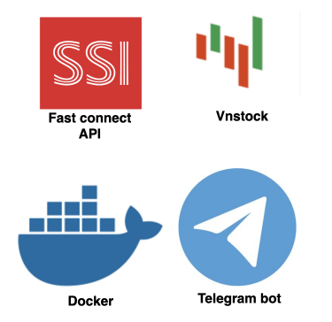
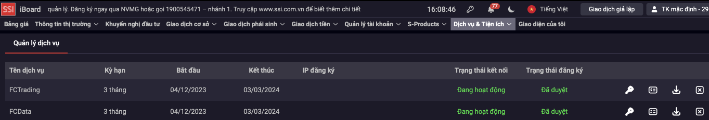

# Build a Real-time VN Stock Alert Messaging System

  

Stay informed on-the-go with our Real-Time Stock Alert Messaging System, an innovative tool designed to deliver instant market updates without the need for constant screen monitoring. Our system leverages Python to provide immediate notifications through the convenient and widely-used Telegram messaging app.

## Getting Started

<b>Prerequisites and Modules</b>

Before setup and running, please ensure you have the following prerequisites in place:

1. <b>Registration for SSI FastAPI Access:</b> This will grant you the necessary permissions to access batch and real-time stock data, as well as execute trades

2. <b>Setting up Telegram Bot:</b> This will receive instant stock alerts and interact with api to get data.

  

3. <b>Docker(version 24.0.2) and Docker compose(version 2.19.1):</b> Make sure you have Docker and Docker compose correctly installed.

